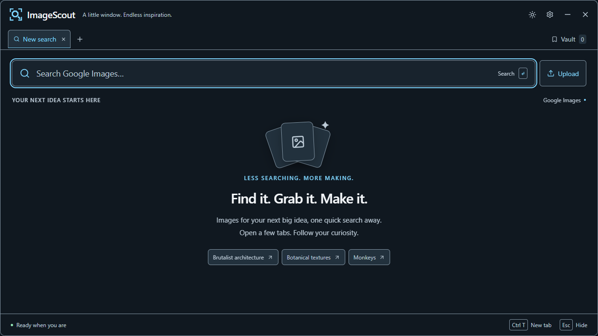
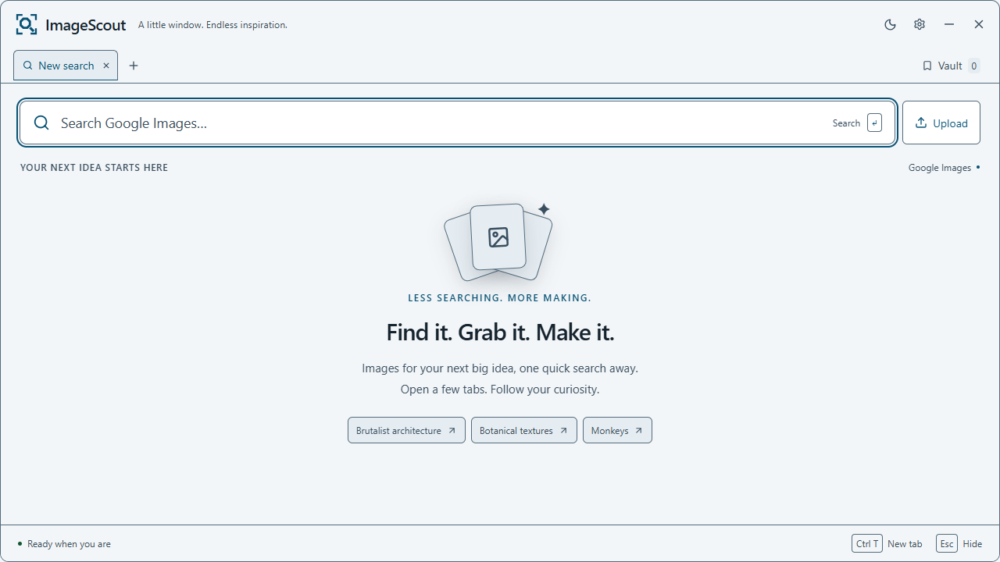
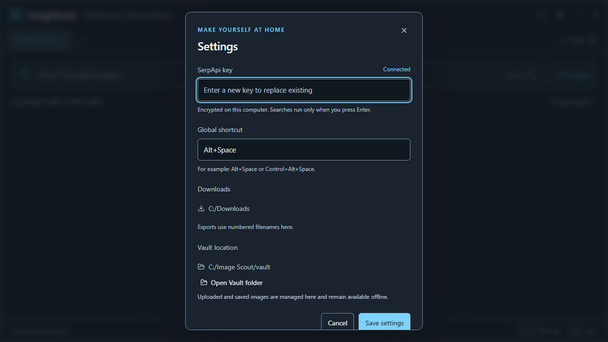
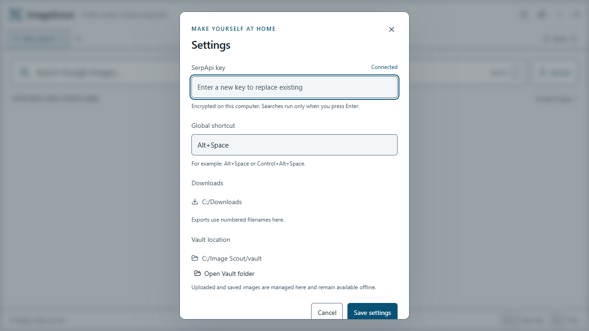

# ImageScout

A compact Windows image launcher. Search Google Images in independent tabs, collect images in a durable local Vault, export numbered PNGs to Downloads, and remove backgrounds locally.

## Screenshots

Light and dark themes with the larger typography and top-left branding. These captures predate the latest logo update.

| Dark theme | Light theme |
| --- | --- |
|  |  |

<details>
<summary>Settings in both themes</summary>

| Dark settings | Light settings |
| --- | --- |
|  |  |

</details>

## Open the app

Run `release/win-unpacked/ImageScout.exe` after packaging, or the portable `release/ImageScout-0.1.0.exe`. Keep the entire `win-unpacked` folder together when using the unpacked app. X, Alt+F4, and Tray → Quit fully exit. The minus button and Escape hide to the tray (Escape closes an open dialog first).

The sun/moon button switches light and dark themes. The initial theme follows Windows; an explicit selection persists. Colors are semantic CSS variables in `src/styles.css`, with normal interface text tested at 7:1 contrast or higher. The approved overlapping-image-frames and arrow logo lives in `resources/logo.svg`; `npm run icons` regenerates the desktop and tray assets.

Existing settings and Vault files remain under the original `Image Scout` user-data directory to preserve upgrades.

Open Settings, paste your SerpApi key, and save. The desktop backend stores it encrypted with Windows DPAPI under the app's user-data folder. The renderer receives only whether a key exists. No key belongs in the source or a chat message. Developers can alternatively supply `SERPAPI_API_KEY` in the launching process environment.

## Shortcuts

- **Alt+Space:** show/hide. If already taken, the app tries **Ctrl+Alt+Space**; Settings shows the actual shortcut and lets you change it.
- **Ctrl+T:** new search tab, even during another search.
- **Ctrl+W:** close the current search tab.
- **Ctrl+L:** focus search.
- **Escape:** close a dialog or hide the app.
- **Alt+F4:** quit ImageScout.

Submit searches with Enter. Copy adds an image to Vault and to the clipboard; Save adds it to Vault and exports it to Downloads. Names use the submitted query, for example `Monkey (1).png`, and never overwrite existing files.

Use **Upload** or drag files onto the window to add local images to the Vault. Vault assets are copied into app-managed local storage, deduplicated by image content, available offline, and searchable by filename, title, and source query. From Vault you can copy, export, reveal, remove backgrounds, or delete an image. Settings shows the Vault folder and can open it. Uploads accept up to 50 images at once, 20 MB per file, and 200 MB per batch; individual failures do not prevent valid files from importing. Downloads and Vault assets are normalized to PNG for reliable clipboard support. Animated formats become a still image; sources that block downloads or unsupported formats show an error.

Background removal runs on this device using IMG.LY's small model. The first use downloads the model/runtime from IMG.LY and is slower; subsequent uses reuse cached assets. No additional API key is needed. Preview the transparent result, then copy or save it; either action stores the cutout in Vault.

## Develop and test

Node 24+:

```powershell
npm install
npm test
npm run build
npm start
npm run test:ui
node scripts/desktop-smoke.cjs
node scripts/window-smoke.cjs
npm run pack
npm run dist
```

The browser preview (`npm run dev`) needs the Electron bridge for real searches and file operations. UI tests inject a fake bridge; desktop smoke tests exercise Electron with a temporary isolated profile and a fake key without making paid search requests. Live SerpApi searches require your own locally entered key.

The app uses `@imgly/background-removal` under AGPL-3.0; the app source is licensed AGPL-3.0-only. This local build is unsigned.

Packaging excludes frontend dependencies already bundled by Vite and retains English Chromium locale resources. Bundled dependency licenses are collected in `resources/THIRD-PARTY-NOTICES.txt` during builds. Electron and the background-removal WebAssembly runtime still account for most of the distribution size.

If Windows locks an existing unpacked build or the packager's archive rename fails, build to a separate directory using the installed Electron runtime:

```powershell
npm run build
npx electron-builder --win portable --config.directories.output=release/updated --config.electronDist=node_modules/electron/dist
```
